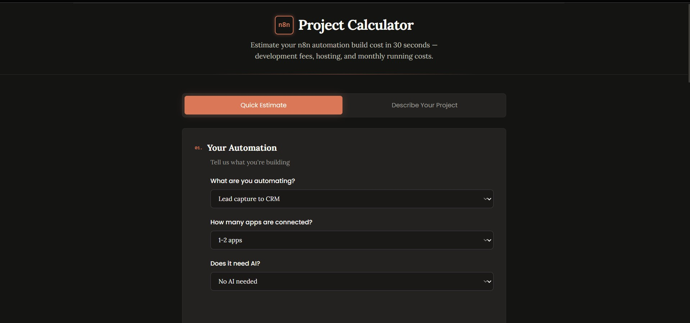
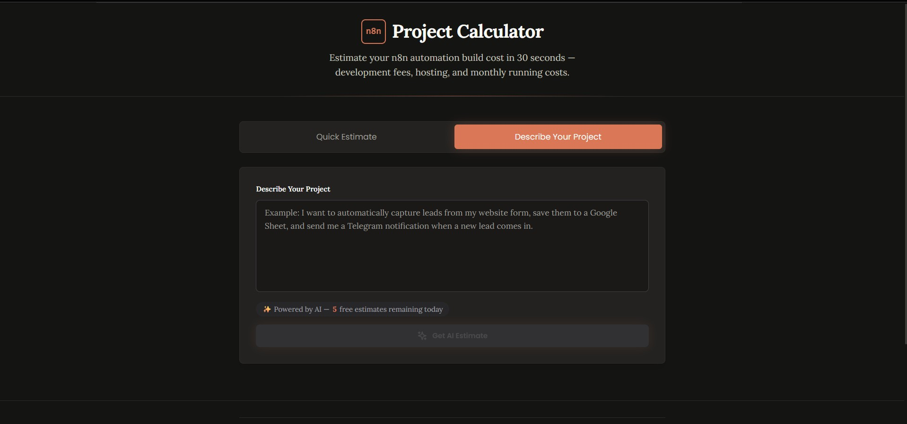
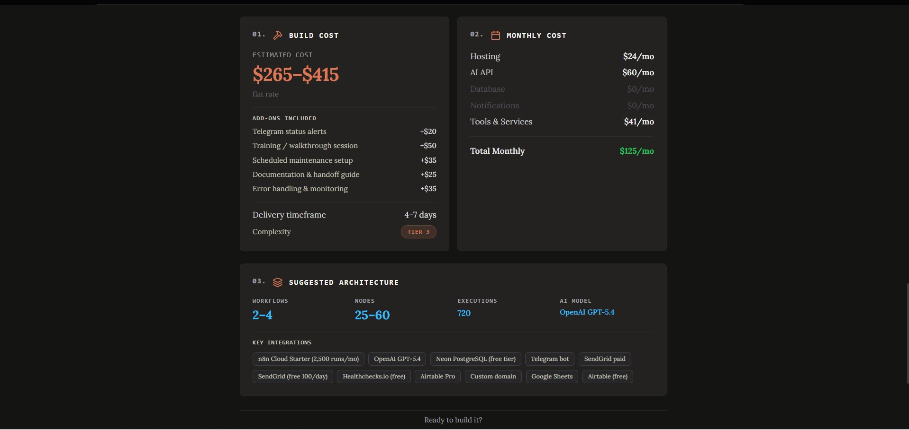

# n8n Project Calculator

Estimate your n8n automation build cost in 30 seconds — development fees, hosting, and monthly running costs.

🔗 **Live:** https://n8n-project-calculator.vercel.app/

---

## What It Does

A free web tool that helps freelancers scope client projects and helps business owners understand what n8n automation actually costs — before hiring anyone.

**Two modes:**

### ⚡ Quick Estimate
Pick from structured dropdowns — automation type, number of apps, AI requirements, hosting, database, notifications, tools, and add-ons. Get instant results with zero API calls.

### 🤖 AI Estimate
Describe your project in plain English. An AI analyzes your description and returns a custom cost breakdown — build cost, monthly running cost, suggested architecture, and key integrations.

---

## Features

- 🧮 **10-field calculator** covering automation type, complexity, hosting, AI provider, database, notifications, tools, and add-ons
- 🤖 **AI-powered estimates** via DeepSeek API — describe your project, get a custom breakdown
- 💰 **Build cost tiers** — Tier 1 ($15-20), Tier 2 ($50), Tier 3 ($100-250) + add-ons
- 📊 **Monthly running cost** breakdown — hosting, AI API, database, notifications, tools
- 🏗️ **Suggested architecture** — workflows needed, estimated nodes, AI model recommendation
- 🏷️ **Key integrations** — auto-detected from your selections
- 📋 **Share button** — copy link to clipboard with toast notification
- ↺ **Reset functionality** — clear all selections or start a new AI estimate
- 🎨 **Color-coded results** — orange (build cost), green (monthly total), blue (architecture specs)
- 📱 **Responsive design** — works on desktop and mobile
- 🔒 **Client-side rate limiting** — 10 AI estimates per day per browser
- 🌙 **Dark mode** — zinc + orange color scheme inspired by n8n's brand

---

## Screenshots

### Quick Estimate


### AI Estimate


### Results


---

## Tech Stack

| Layer | Technology | Cost |
|---|---|---|
| **Frontend** | React + TypeScript + Vite | Free |
| **Styling** | Tailwind CSS | Free |
| **AI** | DeepSeek Chat API (via Vercel Serverless Function) | ~$0.0002/query |
| **Hosting** | Vercel (free tier) | Free |
| **Total Monthly** | | **$0** + pennies for AI |

---

## Getting Started

### Prerequisites

- Node.js 18+
- A DeepSeek API key (https://platform.deepseek.com)

### Local Development

```bash
# Clone the repo
git clone https://github.com/chanrylejay/n8n-project-calculator.git
cd n8n-project-calculator

# Install dependencies
npm install

# Create .env file
echo "DEEPSEEK_API_KEY=your_api_key_here" > .env

# Start dev server
npm run dev
```

Open http://localhost:5173

### Deploy to Vercel

1. Push to GitHub
2. Import the repo on https://vercel.com
3. Add environment variable: `DEEPSEEK_API_KEY` = your API key
4. Deploy — done!

---

## Pricing Logic

The calculator uses a tier-based pricing model:

| Tier | Build Cost | Delivery | Workflows | Nodes |
|---|---|---|---|---|
| Tier 1 (Simple) | $15 – $20 | 1-2 days | 1 | 5-15 |
| Tier 2 (Medium) | $50 | 2-4 days | 1-2 | 15-30 |
| Tier 3 (Complex) | $100 – $250 | 4-7 days | 2-4 | 25-60 |

Tier is determined by automation type + number of apps + AI requirements. Add-ons (error handling, documentation, monitoring, training) are added on top.

Monthly costs are calculated from hosting provider, AI model, database, notification channel, and selected tools.

---

## Project Structure

```
n8n-project-calculator/
├── api/
│   └── estimate.js          # Vercel serverless function (DeepSeek API)
├── src/
│   ├── components/           # React components
│   ├── App.tsx               # Main application
│   └── main.tsx              # Entry point
├── public/                   # Static assets
├── package.json
├── vite.config.ts
└── README.md
```

---

## Who Is This For?

- **Freelancers** — scope n8n projects and give clients confident estimates
- **Business owners** — understand what automation costs before hiring
- **Agencies** — quick cost breakdowns for client proposals
- **n8n community** — a free tool for everyone

---

## Built By

**Chanryle Jay Cagara** — AI Automation Specialist

- 🌐 https://chanryle-cagara.vercel.app
- 💼 Upwork
- 🔗 https://linkedin.com/in/chanrylejay
- 🐙 [GitHub](https://github.com/chanrylejay)

---

## License

MIT — use it, fork it, build on it.
